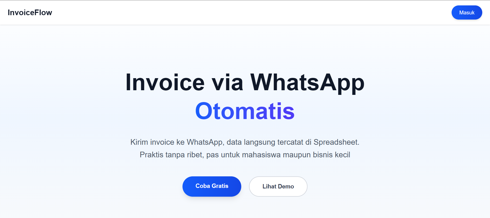
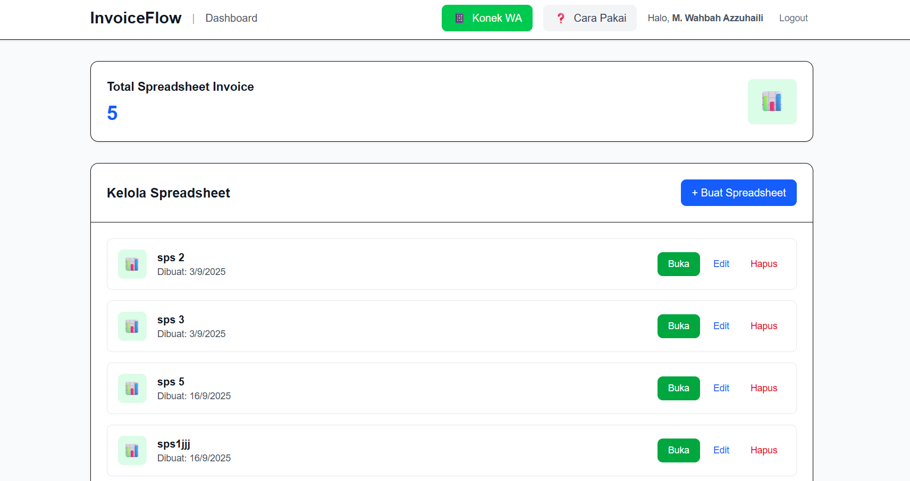

# 📄 Auto Invoice

## 🚀 Core Solution

**Auto Invoice** is an automation solution powered by a WhatsApp Bot that can receive invoice photos, extract data using **OCR + LLM**, and directly insert them into **Google Spreadsheets**.

## ⚙️ How It Works

1. User sends an invoice photo via **WhatsApp**.
2. The bot downloads and processes the image using **EasyOCR**.
3. OCR results are processed by **LLaMA** to perform **structured extraction** (e.g., invoice number, date, total amount, etc.).
4. Extracted data is automatically inserted into the user’s **Google Spreadsheet**.
5. Users can manage **multiple spreadsheets** through a **web dashboard**.

## 🛠️ Tech Stack

* **Backend**: Node.js + Express
* **OCR**: EasyOCR
* **LLM**: LLaMA
* **Database**: PostgreSQL
* **Integration**: Google Sheets API, WhatsApp API (Baileys)
* **Dashboard**: Next.js

## 🌟 Features

* 📷 Send invoices via WhatsApp → data automatically saved
* 🤖 OCR + AI for structured data extraction
* 📊 Direct integration with Google Spreadsheet
* 🗂️ Support for multiple spreadsheets per user
* 🌐 Web dashboard for data management

## 🚧 Roadmap

* [ ] Custom Extraction Header in SPS
* [ ] Improve Quality of Extraction
* [ ] Add support for multiple invoice formats (PDF, DOCX)
* [ ] Export data to other formats (CSV, Excel)
* [ ] Basic analytics (invoice count, monthly totals)

---

💡 **Auto Invoice** helps businesses of all sizes reduce manual bookkeeping, making financial record-keeping faster, more accurate, and more efficient.

---

## 📊 Landing Page View

## Dashboard View

